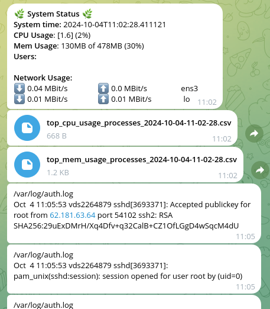

# About
Monitor CPU and memory usage and send per-process info via Telegram when a threshold is exceeded.

Monitor user login and sudo sessions and send notifications via Telegram.

# Overview

This is a minimalistic Telegram bot for Linux (Ubuntu) monitoring with important features:
- Monitors CPU and RAM usage and sends per-process statistics when a threshold is exceeded. 
- Monitors user logins and sudo via /var/log/auth.log and sends updates to Telegram.
- Can be configured to tail any log file and send updates to Telegram.
- Sends per-NIC current network upload and download speed.



Main idea why it exists is that on my small VPS there were random CPU
usage jumps periodically.

I wanted a small and simple monitoring script to send alerts to Telegram.
But I did not find one to send the per-process details to debug the usage jumps.

It does not pretend to be super-clean or fully featured, but a quick and simple 
implementation fitting basic needs: monitor a small VPS linux server for anomalies
or unexpected login attempts.

Please fill free to use or change it upon your will or contact me if you need any help.

# Installation and Configuration

Tested on Ubuntu 22.04.
You can use these instructions or install it manually on your own.

## Pre-requisites
- git;
- python3.8 or above.


## Installation Steps

### Install a systemd service
Run as root (or do in a more secure way on your own).

```shell
sudo -i
cd /opt
git clone <the_project_url>
cd linux_telegram_monitor
./install_ubuntu.sh
```

See install_ubuntu.sh for the exact installation steps.

In short: it prepares a python virtualenv and installs the python
script as a systemd service. 

The script will be run from the current directory.

A .env file in the current dir will be used for configuration.

### Register a new bot in Telegram
In Telegram contact BotFather.

Type: `/newbot`

Follow the instructions to get the new bot token.

Fill the token in the .env file and restart the service with:
```shell
sudo systemctl restart linux-telegram-monitor
```

### Get and fill your chat ID
Now we have the bot token but to ensure that it is only you 
who sees the messages we need to hardcode your chat ID into the service.

The only way to know the chat ID is to contact the bot - it
will be seen on the bot side.

With the service started, contact the bot and type `/start`.

The bot will respond with your chat ID.

Fill it into the .env file and restart the bot again with:
```shell
sudo systemctl restart linux-telegram-monitor
```

Now it should be working.

### Checking status and logs
Checking the service status:
```shell
sudo systemctl status linux-telegram-monitor 
```

Checking the service logs:
```shell
sudo cat /var/log/syslog
```

## Updating

To update - pull the new version from git
and restart or reinstall the service.


Full re-install should be something similar to:
```shell
sudo -i
cd /opt/linux-telegram-monitor
./uninstall_ubuntu.sh
rm -rf venv
git pull origin master
# check if any new .env config needed
./install_ubuntu.sh
```

## Uninstalling

```shell
sudo systemctl stop linux-telegram-monitor
sudo rm /etc/systemd/system/linux-telegram-monitor.service
sudo systemctl daemon-reload
```